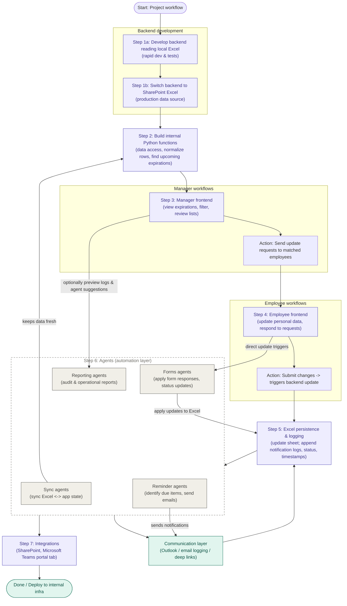

# Workflow

This product is an internal Python application for managing request records. It reads
from and writes back to an Excel workbook stored on SharePoint, surfaces forms and
dashboards to associates from a Python dev application, and automatically chases pending
requests over email. It is designed to run entirely on internal infrastructure with
no cloud dependencies.

The system is organized as a layered architecture. User-facing surfaces sit on top,
the processing core is in the middle, and the data repository is at the base.
Requests flow top‑down toward Excel; status, dashboards, and reports flow back up.



## Layers

**Data layer.** A SharePoint-hosted Excel workbook is the single source of truth for
request records, user details, due dates, statuses, and reminder tracking. End users
do not touch the file directly — only designated administrators or managers maintain
source records.

**Application layer.** A Python web application holds the business logic: request
processing, form submissions, and writing updates back to Excel.

**Automation layer.** Four independent Python agents each own one responsibility:

| Agent | Responsibility |
| --- | --- |
| Sync | Reads and synchronizes records from Excel. |
| Reminder | Identifies pending requests, composes messages, and sends automated reminder emails. |
| Forms | Updates request status and stores user responses. |
| Reporting | Generates operational and audit reports. |

Keeping these as separate agents is also where the longer-term "agentic AI" automation
is intended to plug in.

**Communication layer.** Integrates with Microsoft Outlook via Python
(PyWin32 / Outlook client libraries). The Reminder agent sends emails to associates
and escalation notifications when required; email links deep-link the user straight to
the relevant form in the portal.

**User access layer.** An internal web portal lets users view assigned requests,
complete forms, track submission status, and access dashboards and reports.

**Microsoft Teams integration.** The portal is published as a Microsoft Teams tab
application, built with the SharePoint Framework (SPFx) as a custom installable app.
Users reach the solution directly inside Teams with no separate URL. Teams is the
primary interface, while all processing stays within the Python application and
internal infrastructure, and SharePoint Excel remains the underlying data store.

## Team ownership

| Owner | Area |
| --- | --- |
| Colin Bertrand | Agentic AI development |
| Chinmay Dave | Python development |
| Liam Ben-Zvi | Outlook and Teams app integration |
| Kavit Timbadia | Testing, documentation |

## Editing this diagram

The diagram above is a [Mermaid](https://mermaid.js.org/) `flowchart`, rendered
natively by GitHub. To change it, edit the fenced ```mermaid``` block — add a node,
rename a label, or re-wire an arrow — no image tooling required. A rendered
`docs/architecture.svg` is also kept in the repo for contexts that don't render
Mermaid (e.g. some slide tools and PDF exports).
