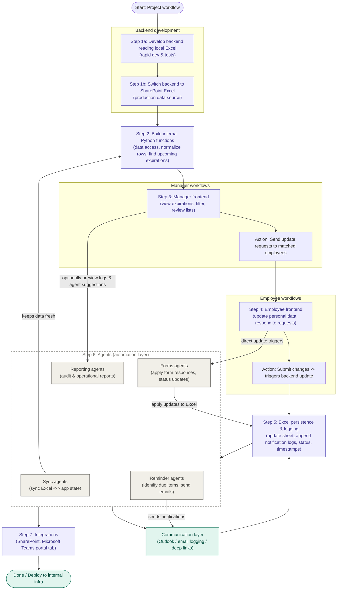

# Workflow

This product is an internal Python application for managing request records. It reads
from and writes back to an Excel workbook stored on SharePoint, surfaces forms and
dashboards to associates from a Python dev application, and automatically chases pending
requests over email. It is designed to run entirely on internal infrastructure with
no cloud dependencies.

The system is organized as a layered architecture. User-facing surfaces sit on top,
the processing core is in the middle, and the data repository is at the base.
Requests flow top‑down toward Excel; status, dashboards, and reports flow back up.



## Workflow Steps

### Step 1: Backend development
- **Step 1a:** Develop backend reading local Excel (rapid dev & tests)
- **Step 1b:** Switch backend to SharePoint Excel (production data source)

### Step 2: Build internal Python functions
- Data access layer
- Normalize rows
- Find upcoming expirations

### Step 3: Manager workflows
- **Step 3a:** Manager frontend (view expirations, filter, review lists)
- **Step 3b:** Action — Send update requests to matched employees

### Step 4: Employee workflows
- **Step 4a:** Employee frontend (update personal data, respond to requests)
- **Step 4b:** Action — Submit changes (triggers backend update)

### Step 5: Excel persistence & logging
- Update sheet with changes
- Append notification logs
- Record status and timestamps

### Step 6: Agents (automation layer)
- **Sync agents:** Sync Excel ↔ app state
- **Reminder agents:** Identify due items and send emails
- **Forms agents:** Apply form responses and status updates
- **Reporting agents:** Audit & operational reports

### Step 7: Integrations
- SharePoint integration
- Microsoft Teams portal tab

### Communication & Deployment
- Communication layer (Outlook / email logging / deep links)
- Deploy to internal infrastructure

**Automation layer.** 

Four groupings of independent Python agents each own different responsibilities:

| Agent | Responsibility |
| --- | --- |
| Sync | Reads and synchronizes records from Excel. |
| Reminder | Identifies pending requests, composes messages, and sends automated reminder emails. |
| Forms | Updates request status and stores user responses. |
| Reporting | Generates operational and audit reports. |

These groups are intended to have multiple agents to help automate the overall process.

## Editing this diagram

The diagram above is a [Mermaid](https://mermaid.js.org/) `flowchart`, rendered
natively by GitHub. To change it, edit the fenced ```mermaid``` block — add a node,
rename a label, or re-wire an arrow — no image tooling required. A rendered
`docs/architecture.svg` is also kept in the repo for contexts that don't render
Mermaid (e.g. some slide tools and PDF exports).
